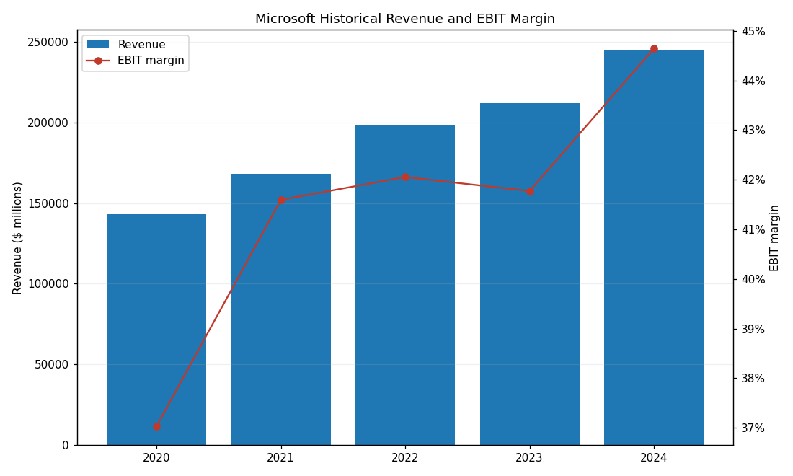
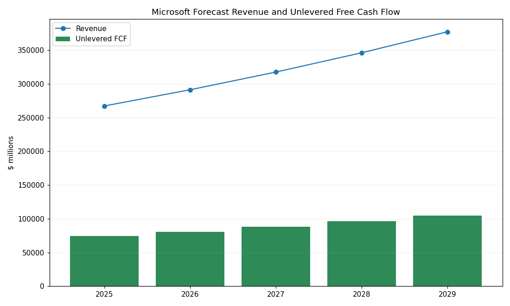
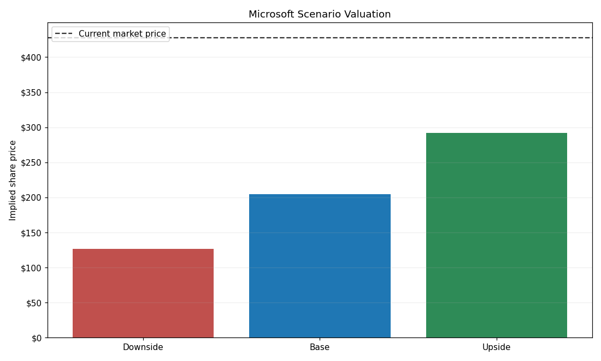
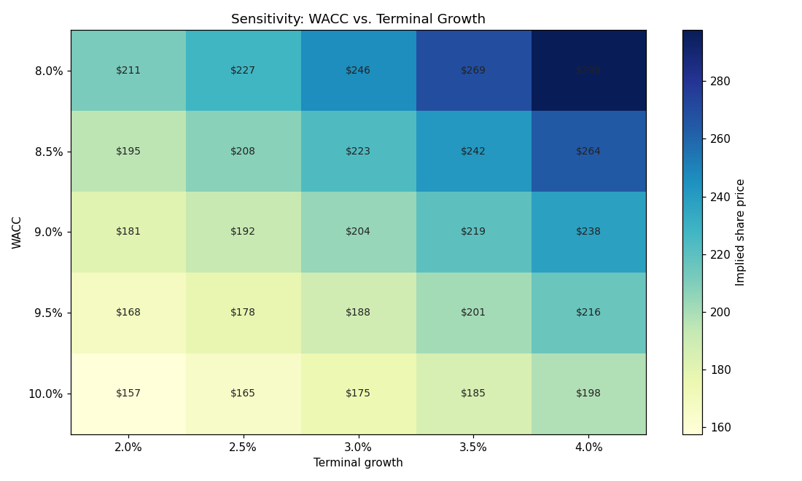

# Microsoft (MSFT) DCF Valuation Model

This project is a fundamental financial analysis tool built with Python and `yfinance` to calculate the intrinsic value of large-cap equities and determine if an asset is fundamentally overvalued or undervalued by the market.

A fully reproducible, code-driven **Discounted Cash Flow (DCF)** valuation of
Microsoft Corporation built in Python. The model projects unlevered free cash
flow over a five-year horizon, discounts it at the weighted average cost of
capital (WACC), and derives an implied intrinsic share price. It also runs a
scenario analysis and a WACC vs. terminal-growth sensitivity grid, and renders
the headline charts.

All monetary figures are in **US$ millions** unless otherwise noted.

## The Objective

To build a dynamic 5-year Discounted Cash Flow (DCF) model that automatically adjusts to real-time macroeconomic conditions. Instead of relying on static, hardcoded discount rates, this model programmatically engineers a live Weighted Average Cost of Capital (WACC) using the Capital Asset Pricing Model (CAPM).

## How It Works

1. **Dynamic WACC Calculation (CAPM):** Pulls the live 10-Year Treasury Yield (^TNX) to establish a risk-free rate, retrieves the target equity's real-time Beta, and calculates the precise Cost of Equity to dynamically discount future cash flows.
2. **Financial Data Ingestion:** Automatically aggregates real-time corporate financial statements (Free Cash Flow, Total Debt, Cash Equivalents, Shares Outstanding) via the Yahoo Finance API.
3. **Future Cash Flow Projection:** Projects Free Cash Flow 5 years into the future using conservative growth assumptions and discounts it back to Present Value using the dynamically calculated WACC.
4. **Intrinsic Value Calculation:** Calculates Terminal Value and Enterprise Value to derive the precise intrinsic value per share, outputting an automated pricing verdict (Undervalued vs. Overvalued) compared to the live trading price.

## Project structure

```
msft-dcf-valuation/
├── data/
│   └── msft_historical_financials.csv     # FY2020–FY2024 source financials
├── outputs/                               # generated by running the model
│   ├── forecast_model.csv                 # 5-year operating & FCF forecast
│   ├── scenario_analysis.csv              # Downside / Base / Upside results
│   ├── sensitivity_wacc_terminal_growth.csv
│   ├── valuation_summary.csv              # headline valuation outputs
│   ├── historical_revenue_margin.png
│   ├── forecast_revenue_fcf.png
│   ├── scenario_valuation.png
│   └── sensitivity_wacc_terminal_growth.png
├── msft_dcf_model.py                      # the model
├── requirements.txt
└── README.md
```

## Implementation details (this repository)

The committed code in `msft_dcf_model.py` implements the methodology above with
a **live, CAPM-derived WACC**. Concretely, the model:

1. **Dynamic CAPM WACC** – Pulls the live 10-Year Treasury yield (`^TNX`) for the
   risk-free rate and Microsoft's Beta, market cap, total debt, cash, shares and
   price from Yahoo Finance (`yfinance`). It builds the CAPM cost of equity
   (`risk-free + β × equity risk premium`), blends it with an after-tax cost of
   debt by capital-structure weights, and uses the resulting **WACC** as the
   discount rate.
2. **Historical ingestion** – Loads Microsoft's FY2020–FY2024 income-statement
   and cash-flow data from `data/msft_historical_financials.csv` and computes
   historical EBIT margins and net debt.
3. **Operating forecast** – Projects revenue, EBIT, NOPAT, depreciation &
   amortization, capex, and the change in net working capital to build
   **unlevered free cash flow** for each forecast year.
4. **Discounting** – Discounts each year's FCF at the dynamic WACC and adds the
   present value of a Gordon-growth **terminal value** to obtain enterprise
   value.
5. **Equity bridge & verdict** – Subtracts net debt and divides by shares
   outstanding to get the **implied intrinsic share price**, then prints an
   **Undervalued / Overvalued** verdict versus the live market price.
6. **Scenario analysis** – Re-runs the model under Downside, Base, and Upside
   assumption sets (Base uses the live WACC; Downside / Upside shifts it ±0.5%).
7. **Sensitivity analysis** – Recomputes the implied share price across a grid
   of WACC (centered on the live WACC, ±1.0%) and terminal-growth values.
8. **Reporting** – Writes all results to `outputs/*.csv` and renders the charts.

### Live vs. reproducible (offline) runs

- `python msft_dcf_model.py` uses **live market data**, so the WACC, current
  price, verdict, and every chart reflect current conditions and change over
  time.
- `python msft_dcf_model.py --offline` (or any run where the network/API is
  unavailable) falls back to **fixed, documented assumptions** — a 9.0% WACC and
  a $428 reference price. **The charts and CSVs checked into this repository are
  produced by this reproducible offline baseline**, so the figures cited below
  correspond to the `--offline` run.

## Charts

All charts below are generated by running the model and are saved to the
`outputs/` directory. The committed versions come from the reproducible
`--offline` baseline (9.0% WACC, $428 reference price); a live run regenerates
them with the current market WACC and price.

### Historical revenue and EBIT margin



**What it shows.** The blue bars are Microsoft's reported revenue for fiscal
years 2020–2024 (left axis, $ millions); the red line is the EBIT (operating)
margin for the same years (right axis, %).

**Why the numbers look this way.** Revenue climbs steadily from ~$143B (FY2020)
to ~$245B (FY2024) — roughly a 14% annual compound rate — driven mainly by
Azure/cloud and the growth of the commercial software franchise. At the same
time, the EBIT margin expands from ~37% to ~44.6%. That margin lift is the story
of **operating leverage**: as high-margin cloud and software revenue scales,
fixed costs are spread over a larger base, so each new dollar of revenue drops
more profit to the operating line. This chart is the foundation for the
forecast — it justifies modeling a high, durable EBIT margin going forward.

### Forecast revenue and unlevered free cash flow



**What it shows.** The blue line is projected revenue for FY2025–FY2029(rising
from $267B to $377B); the green bars are the **unlevered free cash flow**
(FCF) The model is derived for each of those years ($74B rising to $105B).

**Why the numbers look this way.** Revenue grows at the base-case assumption of
**9% per year**, compounding off the FY2024 base of ~$245B. The FCF bars track
revenue because the model assumes a roughly constant **unlevered FCF margin of
~27.8%** of revenue. That margin is built bottom-up:

```
NOPAT margin            = 45.0% EBIT × (1 − 16% tax) = 37.8%
+ Depreciation & amort. = +7.0%
− Capital expenditure   = −13.0%
− Change in net working capital = −4.0%
= Unlevered FCF margin  ≈ 27.8%
```

The gap between the revenue line and the FCF bars is deliberate: Microsoft is
reinvesting heavily (large capex on data centers / AI capacity), so a meaningful
slice of operating profit is consumed before it becomes free cash flow. These
five FCF values are exactly what gets discounted in the DCF.

### Scenario valuation



**What it shows.** The implied intrinsic share price under three assumption sets
— **Downside (~$127)**, **Base (~$204)** and **Upside (~$292)** — with the
dashed line marking the current market price (~$428).

**Why the numbers look this way.** Each bar re-runs the full DCF with a
different, internally consistent set of assumptions:

| Scenario | Revenue growth | EBIT margin | WACC | Terminal growth | Implied price |
| --- | --- | --- | --- | --- | --- |
| Downside | 4% | 42% | 9.5% | 2.0% | ~$127 |
| Base | 9% | 45% | 9.0% | 3.0% | ~$204 |
| Upside | 12% | 47% | 8.5% | 3.5% | ~$292 |

Higher growth and margins increase the cash flows, while a lower WACC and a
higher terminal-growth rate increase how much those future cash flows are worth
today — so the Upside stacks all the favorable assumptions and the Downside
stacks the conservative ones. All three bars sit **below** the market price,
which means that on these (deliberately disciplined) assumptions, the market is
pricing in faster growth, fatter margins, and/or a lower cost of capital than
the model assumes. The chart is a quick visual of the valuation range versus
where the stock actually trades.

### Sensitivity: WACC vs. terminal growth



**What it shows.** A heat map of the implied share price as the **WACC** (rows,
8.0%–10.0%) and the **terminal growth rate** (columns, 2.0%–4.0%) vary, holding
the base-case operating forecast fixed. Darker cells are higher valuations.

**Why the numbers look this way.** Value rises toward the **top-right** (low
WACC, high terminal growth) and falls toward the **bottom-left** (high WACC, low
terminal growth). The center cell (9.0% WACC, 3.0% growth) equals the base-case
~$204. The grid swings widely — from ~$157 to ~$298 — because most of the
valuation lives in the **terminal value**, which is governed by the spread
between WACC and growth:

```
Terminal value = final-year FCF × (1 + g) / (WACC − g)
```

As that `(WACC − g)` denominator shrinks (lower WACC, higher g), the terminal
value — and therefore the share price — increases sharply. This is why DCF
outputs are so sensitive to these two inputs, and why the model presents a grid
rather than a single point estimate: small, defensible changes in the discount
The rate or long-run growth assumption moves the answer materially.

## Key base-case assumptions

| Assumption                         | Value |
| ---------------------------------- | ----- |
| Revenue growth (annual)            | 9.0%  |
| EBIT margin                        | 45.0% |
| Cash tax rate                      | 16.0% |
| D&A (% of revenue)                 | 7.0%  |
| Capex (% of revenue)               | 13.0% |
| Change in NWC (% of revenue)       | 4.0%  |
| WACC                               | dynamic CAPM (9.0% offline fallback) |
| Terminal growth                    | 3.0%  |

These flow through to an implied **unlevered FCF margin of ~27.8%** of revenue.
The WACC is engineered live from CAPM on each run; the 9.0% value above is the
offline fallback used for the committed charts.

## Running the model

```bash
pip install -r requirements.txt
python msft_dcf_model.py
```

Running the script prints a summary to the console and regenerates every file
in `outputs/`.

## Disclaimer

This project is for educational and illustrative purposes only. It is **not**
investment advice. Assumptions are simplified and the implied values should not
be relied upon for any investment decision.
